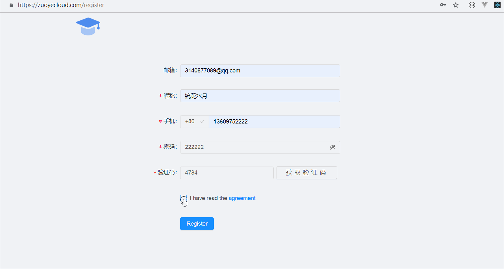
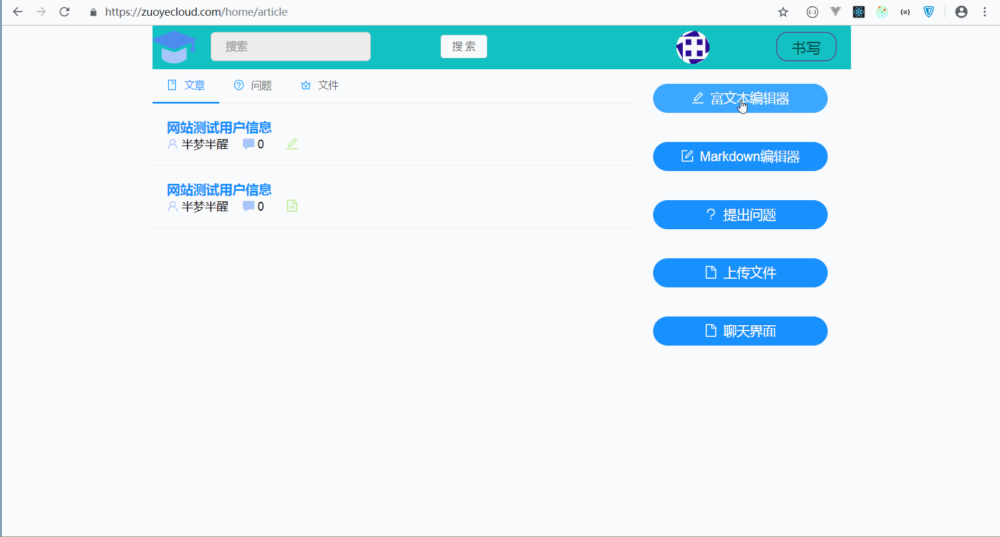
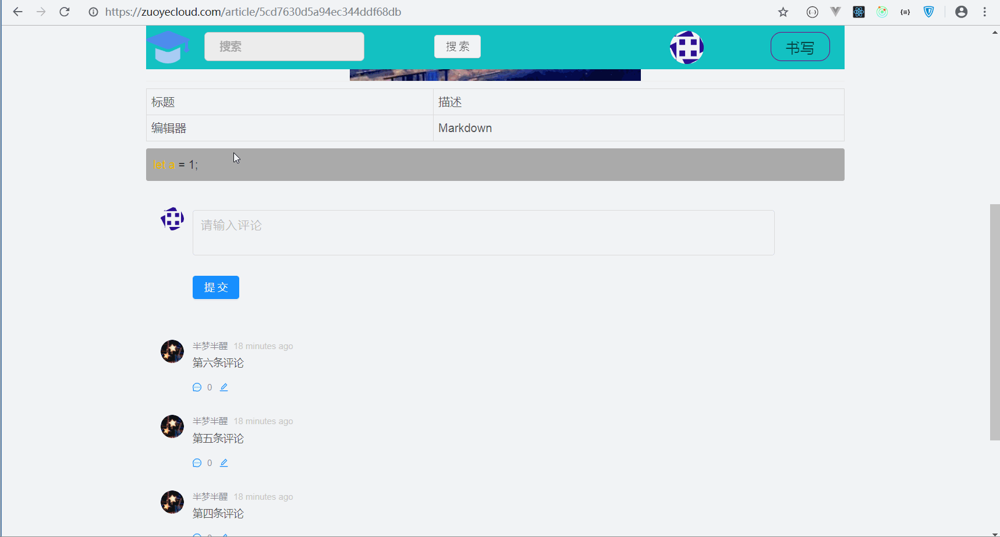
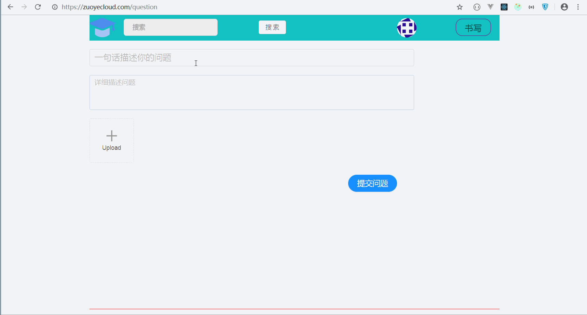
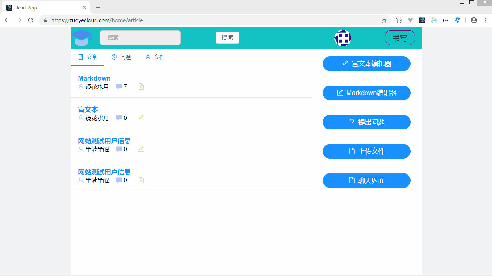
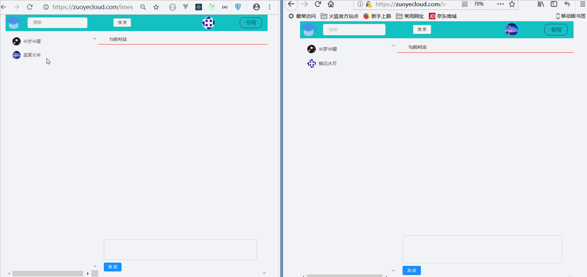
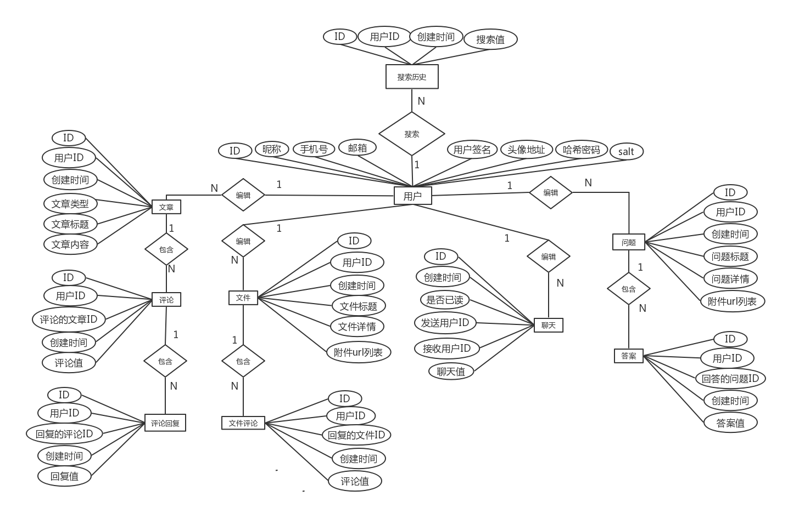

# 学习分享社区

###介绍
>根据个人所学知识搭建一个学习社区。

###技术说明
##前端部分
- [x] 登陆/注册
- [x] 用户信息修改
- [x] 富文本/Markdown编辑器
- [x] 文章评论
- [x] 文件上传/提出问题
- [x] 实时聊天

##后端部分
- [x] mongoose数据库操作
- [x] 路由管理
- [x] 身份验证
- [x] 短信/图片验证码
- [x] ...

##技术栈
- [x] react
- [x] react-redux
- [x] react-router-dom
- [x] redux-thunk
- [x] immutable
- [x] styled-components
- [x] antd
- [x] socket.io
- [x] webpack
- [x] Express
- [x] Mongodb
- [x] Mongoose

##项目运行效果

## 登陆注册

## 文章编辑器/展示

## 文章评论

## 提问

## 上传文件

## 聊天

### 后端相关表

------------------
####后端数据库

####Mongoose封装的一些方法

|用户|
|-|-|-|
|POST|私|新增用户（邮件, 昵称, 电话, 密码)|
|POST|私|更新用户(用户ID, 更新数据)|
|GET|公|查询用户数据（用户ID）|

|搜索历史|
|-|-|-|
|POST|私|新增搜索历史(用户ID，搜索值)|
|GET|私|删除搜索历史(搜索历史ID)|
|GET|私|查询搜索历史(用户ID)|

|文章|
|-|-|-|
|POST|私|新增文章(用户ID, 文档类型, 标题,  内容)|
|GET|公|根据搜索值或用户ID获取文章列表(搜索值或者用户ID)|
|GET|公|根据文章ID获取文章(文章ID)|

|评论|
|-|-|-|
|POST|私|新增文章评论(用户ID, 文章ID,  评论值)|
|GET|公|查询文章评论(文章ID, 跳过评论数, 每次获取评论数)|

|评论回复|
|-|-|-|
|POST|私|新增评论回复(用户ID, 评论ID,  回复值）|
|GET|公|查询评论回复(评论ID)|

|问题|
|-|-|-|
|POST|私|新增问题(用户ID, 标题, 详情, 图片URL列表)|
|GET|公|根据搜索值或用户ID获取问题列表(搜索值或者用户ID)|
|GET|公|根据问题ID获取问题详细信息(问题ID)|

|答案|
|-|-|-|
|POST|私|新增问题答案(用户ID, 问题ID,  答案值)|
|GET|公|查询问题答案(答案ID)|

|文件|
|-|-|-|
|POST|私|新增文件(用户ID, 标题, 详情, 文件URL列表)|
|GET|公|根据搜索值或用户ID获取文件列表(搜索值或者用户ID)|
|GET|公|根据文件ID获取文件详细信息(文件ID)|
|评论|
|-|-|-|
|POST|私|新增文件评论(用户ID, 文件ID,  评论值)|
|GET|公|查询文件评论(文件ID)|

|聊天(私有)-首次连接 – 保存连接对象socket|
|-|-|
|初始化|查询所有用户及聊天信息（用户ID） |
|查看信息|修改未读信息状态(用户ID, 聊天对象ID)|
|发送信息|新增信息到数据库中(socket对象数组, 信息)|

